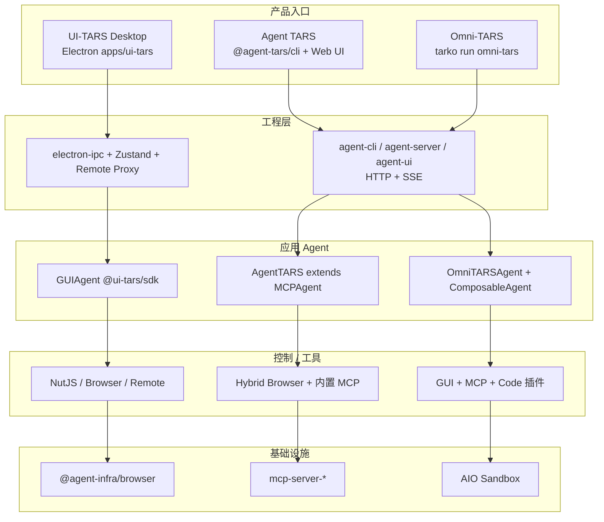
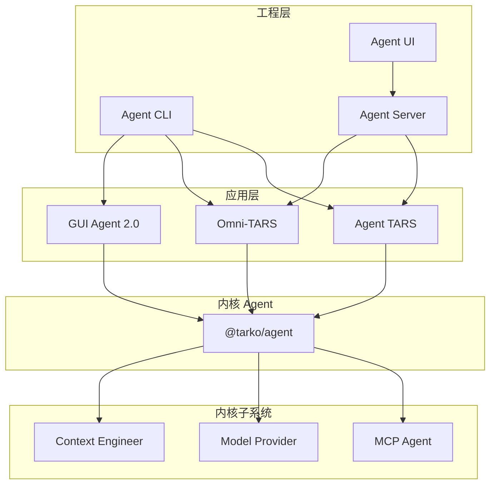
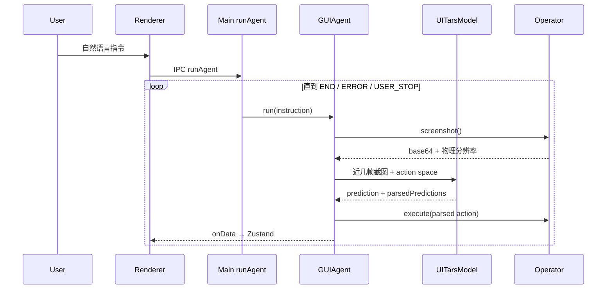
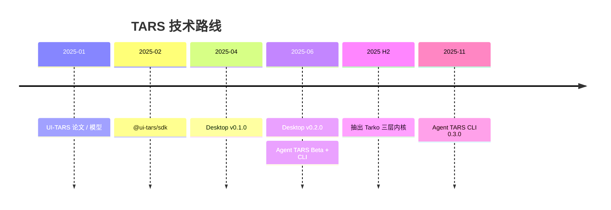

# TARS 架构与技术路线

基于当前仓库实现：ByteDance 多模态 Agent 栈同时维护两条产品线——**UI-TARS Desktop**（本地 GUI Agent）与 **Agent TARS / Omni-TARS**（Tarko 内核上的通用多模态 Agent）。

分析来源为源码、官方架构文档与 `multimodal/CHANGELOG.md` 0.3.0。

| 指标 | 值 |
|------|----|
| 产品线 | 2 |
| Agent TARS 当前版本 | 0.3.0 |
| Tarko 内核包 | 21 |
| pnpm workspace | 2 |

---

## 目录

- [1. 总览与分层](#1-总览与分层)
- [2. 运行时数据流](#2-运行时数据流)
- [3. 包与模块](#3-包与模块)
- [4. 技术路线](#4-技术路线)
- [来源](#来源)

---

## 1. 总览与分层

> **双栈并存，尚未完全收敛。** UI-TARS Desktop 仍走 `@ui-tars/sdk` 自包含循环（截图 → VLM → 动作解析 → Operator）。Agent TARS / Omni-TARS / GUI Agent 2.0 走 Tarko 事件流内核。两者共享 `@agent-infra` 浏览器与 MCP 基础设施，但 Agent 运行时协议不同。

### 1.1 产品对照

| | UI-TARS Desktop（1.x 产品） | Agent TARS / Omni-TARS（2.x 栈） |
|---|---|---|
| 定位 | 原生桌面 GUI Agent。自然语言驱动本地/远程计算机与浏览器，模型以 UI-TARS 与 Seed-VL 为主。 | 通用多模态 Agent。CLI 与 Web UI 开箱即用，内核建立在 MCP 与 Event Stream 上，GUI 只是能力之一。 |
| 入口 | `apps/ui-tars` | `@agent-tars/cli` |
| 核心 | `@ui-tars/sdk` | `@tarko/agent` |
| MCP | 不接入 | 可挂载 MCP Server |

### 1.2 分层对照矩阵

三列是面向用户的产品形态；行是同一抽象层在三条线上的落地。共享底座在最下层通过 `@agent-infra` 交叉。

| 抽象层 | UI-TARS Desktop | Agent TARS | Omni-TARS |
|--------|-----------------|------------|-----------|
| 产品入口 | Electron 桌面应用 `apps/ui-tars` | `@agent-tars/cli` + Web UI | `tarko run omni-tars` |
| 工程层 | electron-ipc · Zustand 主进程状态 · 远程 Proxy | agent-cli · agent-server / server-next · agent-ui (HTTP+SSE) | 同一套 Tarko 工程层 + Code Server / VNC 导航 |
| **应用 Agent** | GUIAgent (`@ui-tars/sdk`) + UITarsModel | AgentTARS extends MCPAgent | OmniTARSAgent + ComposableAgent 插件 |
| 控制 / 工具 | NutJS / Browser / Remote Computer+Browser | Hybrid Browser（视觉+DOM）+ 内置 MCP | GUI + MCP + Code 插件，T5 ToolCall 路由 |
| 基础设施 | `@agent-infra/browser` · 远程沙箱 HTTP/CDP | `mcp-server-{browser,filesystem,commands,search}` | AIO Sandbox (`@agent-infra/sandbox`) |
| 模型 | UI-TARS / Seed-1.5-VL 视觉动作空间 | OpenAI 兼容多模态 LLM + native/prompt tool call | Seed / UI-TARS-2 T5 流式解析 |



### 1.3 Tarko 三层依赖

官方架构把 `multimodal/tarko` 分成工程层、应用层、内核层。工程层通过协议消费任意 `IAgent`；应用层只组合内核能力，不反向依赖 UI。



数据路径：**UI → Server（SSE）· CLI → 应用 Agent → `@tarko/agent`**。

### 1.4 设计原则（实现中已落地）

**协议优先**

AgentEventStream 同时驱动 Context、持久化、Web UI 与 Snapshot 回放。UI 通过 HTTP + SSE 消费同一事件，而不是私有 socket 协议。

**Operator / Tool 可替换**

Desktop 用 `screenshot` / `execute` 契约；Tarko 用 Tool + ToolCallEngine（`native` / `prompt_engineering` / `structured_outputs` / 自定义）。

**OpenAI 兼容模型面**

`@tarko/llm-client` + `model-provider` 覆盖 OpenAI、Anthropic、Gemini、Volcengine 等；Desktop 则直接走 OpenAI Chat/Responses 调 UI-TARS。

**沙箱与本地双环境**

Agent TARS 可选 Local MCP 或 AIO Sandbox；Omni 默认把 GUI/Code 放到隔离沙箱；Desktop 则直接操控本机或远程云桌面。

---

## 2. 运行时数据流

Desktop 循环是**视觉闭环**：每轮必须截图。Tarko 循环是**工具闭环**：模型决定是否调用 Tool，事件流记录全过程。Agent TARS 的浏览器 GUI 把前者嵌进后者，作为 `browser_vision_control` 工具。

### 2.1 UI-TARS Desktop · GUIAgent

1. 用户指令经 IPC 进入主进程 `runAgent`
2. `Operator.screenshot()` 得到 base64 + 物理分辨率
3. `UITarsModel` 携带近几帧截图调用 VLM
4. `@ui-tars/action-parser` 解析 click/type/scroll
5. `Operator.execute()` 落到 NutJS / Browser / Remote
6. `onData` 写 Zustand，渲染进程订阅刷新

关键文件：`packages/ui-tars/sdk/src/GUIAgent.ts` · `apps/ui-tars/src/main/services/runAgent.ts`



### 2.2 Tarko · `Agent.run()`

1. UI `POST /api/v1/sessions/.../query/stream`
2. Context Engineer 展开引用并压缩图片
3. 写入 `user_message` / `environment_input` / `agent_run_start`
4. LoopExecutor：`onPrepareRequest` → 流式 LLM
5. ToolProcessor 执行 Tool（含 MCP / GUI / Code）
6. SSE 推送事件，直到 assistant 终态或达 `maxIterations`

关键文件：`tarko/agent/src/agent/agent.ts` · `agent-server/src/core/AgentSession.ts`

```mermaid
sequenceDiagram
  participant UI as Agent UI
  participant Sess as AgentSession
  participant Agent as @tarko/agent
  participant Loop as LoopExecutor
  participant LLM as LLMProcessor
  participant Tools as ToolProcessor

  UI->>Sess: POST query/stream
  Sess->>Agent: run({ input, stream })
  Agent->>Agent: user_message / agent_run_start
  loop 直到终态或 maxIterations
    Agent->>Loop: executeLoop
    Loop->>LLM: onPrepareRequest → 流式 LLM
    alt 存在 toolCalls
      LLM->>Tools: processToolCalls
      Tools-->>Agent: tool_result（MCP / GUI / Code）
    else 无 toolCalls
      Loop->>Loop: assistant 终态
    end
    Agent-->>UI: SSE 事件
  end
  Agent->>Agent: agent_run_end
```

### 2.3 Desktop Operator 选择

| 模式 | Operator | 执行面 | 模型来源 |
|------|----------|--------|----------|
| Local Computer | `NutJSElectronOperator` | 本机键鼠 / 截屏（需辅助功能权限） | 本地配置的 VLM |
| Local Browser | `DefaultBrowserOperator` | Puppeteer LocalBrowser（`@agent-infra/browser`） | 本地配置的 VLM |
| Remote Computer | `RemoteComputerOperator` | 云沙箱 HTTP 控制面（鼠标键盘） | 远程免费 VLM 代理 |
| Remote Browser | `RemoteBrowserOperator` | 远端 CDP / WebSocket | 远程免费 VLM 代理 |

文档注明免费 Remote Operator 服务于 **2025-08-20 停止**；代码路径仍在 `apps/ui-tars/src/main/remote/`。

### 2.4 Agent TARS 混合浏览器

同一浏览器实例同时暴露视觉 grounding 与 DOM MCP 工具。默认 `hybrid`：模型既可 `browser_vision_control` 点选，也可走导航/内容提取等 DOM 工具。

| `browser.control` | 策略类 | 工具集合 |
|-------------------|--------|----------|
| `dom` | `BrowserDOMStrategy` | MCP browser 工具（DOM） |
| `visual-grounding` | `BrowserVisualGroundingStrategy` | `browser_vision_control`（GUI） |
| `hybrid`（默认） | `BrowserHybridStrategy` | GUI + 导航/内容辅助 + 部分 DOM MCP |

### 2.5 Omni-TARS 插件组合

| 插件 | 职责 |
|------|------|
| GUI | `COMPUTER_USE_ENVIRONMENT`。`AIOHybridOperator` / `AIOGameOperator`。模式 `omni` / `gui` / `game`。 |
| MCP | 搜索、读链接、外部 `mcpServers`。与 Agent TARS 内置 in-memory MCP 不同，偏配置挂载。 |
| Code | `execute_bash`、Jupyter、str-replace，经 `AioClient` 在沙箱执行，对应 CodeAct 路径。 |

`ComposableToolCallEngine` 按 `canHandle()` 把一次模型输出路由到 GUI / MCP / Code 引擎；GUI 侧使用 T5 流式解析器，而不是 OpenAI 原生 function call。

---

## 3. 包与模块

### 3.1 仓库切分

根 `pnpm-workspace` 覆盖 `apps/*`、`packages/ui-tars`、`packages/agent-infra`。`multimodal/` 是第二套 workspace（Node ≥ 22），发布线独立（当前 0.3.0）。

| Workspace | 范围 | 说明 |
|-----------|------|------|
| 根 workspace | UI-TARS Desktop 产品与 1.x SDK | 构建用 turbo；桌面入口 `pnpm dev:ui-tars` |
| multimodal workspace | Tarko + Agent TARS + Omni-TARS + GUI Agent 2.0 + 站点文档 | 构建顺序 tarko → gui-agent → agent-tars → omni-tars |

### 3.2 Tarko 内核包

| 包 | 层 | 职责 |
|----|----|------|
| `@tarko/agent-interface` | 契约 | IAgent、EventStream、Tool、Hook |
| `@tarko/agent` | 内核 | AgentRunner / LoopExecutor / 三种 ToolCallEngine |
| `@tarko/mcp-agent` | 内核 | MCPClientV2，把 MCP 工具注册进 Agent |
| `@tarko/model-provider` | 内核 | resolveModel + OpenAI 兼容客户端 |
| `@tarko/context-engineer` | 内核 | 图片压缩、上下文引用展开、workspace pack |
| `@tarko/agent-snapshot` | 内核 | LLM/事件录制回放，确定性评测 |
| `@tarko/agent-server` | 工程 | Express + 内存 Session + SQLite/Mongo |
| `@tarko/agent-server-next` | 工程 | Hono + DAO + Session 池 + Sandbox hook |
| `@tarko/agent-ui` | 工程 | Jotai + SSE 事件处理器 |
| `@tarko/agent-cli` | 工程 | 一键拉起 agent + server + UI |

### 3.3 UI-TARS 1.x 包

| 包 | 职责 |
|----|------|
| `@ui-tars/sdk` | GUIAgent 循环、UITarsModel、Operator 契约 |
| `@ui-tars/action-parser` | VLM 文本 → PredictionParsed（含 1.5 smart resize） |
| `@ui-tars/operator-nut-js` | 跨平台桌面键鼠 |
| `@ui-tars/operator-browser` | Local/Remote Browser（Puppeteer） |
| `@ui-tars/operator-adb` | Android adb |
| `@ui-tars/electron-ipc` | 类型化 IPC 路由 |
| `@ui-tars/cli` | 命令行 GUI Agent |

### 3.4 共享基础设施

| 包 | 被谁使用 |
|----|----------|
| `@agent-infra/browser` | Desktop BrowserOperator、Agent TARS 本地浏览器、GUI 2.0 |
| `@agent-infra/mcp-client` | Tarko MCPAgent、Agent TARS 本地环境 |
| `@agent-infra/mcp-server-browser` | Agent TARS in-memory MCP |
| `@agent-infra/mcp-server-filesystem` | Agent TARS 文件工具 |
| `@agent-infra/mcp-server-commands` | Agent TARS shell |
| `@agent-infra/mcp-server-search` | 搜索 MCP（Bing/DDG/Browser/Tavily） |
| `@agent-infra/sandbox` | Omni / Agent TARS AIO 环境（外部依赖） |

> **两套 GUI Agent SDK。** `@ui-tars/sdk` 与 `@gui-agent/agent-sdk` 并存。后者基于 Tarko Agent + `GUIAgentToolCallEngine`，被 Agent TARS 浏览器 GUI 与 Omni GUI 插件复用。Desktop 应用尚未切换。

---

## 4. 技术路线

仓库没有单独的 roadmap 文档。下面按 README News、Beta 博文与 CHANGELOG 还原。

### 4.1 已落地演进

| 时间 | 里程碑 | 架构含义 |
|------|--------|----------|
| 2025-01 | UI-TARS 论文 / 模型 | 视觉 GUI Agent 作为独立产品成立 |
| 2025-02 | `@ui-tars/sdk` | 截图-预测-执行循环产品化，Operator 可插拔 |
| 2025-04 | Desktop v0.1.0 | 新 Agent UI；Computer + Browser；UI-TARS-1.5 |
| 2025-06 | Desktop v0.2.0 | Remote Computer / Browser Operator（云端执行面） |
| 2025-06-25 | Agent TARS Beta + CLI | 从“只有 GUI”转向 Event Stream + MCP + 可解耦 UI |
| 2025 H2 | 抽出 Tarko | 三层架构：工程 / 应用 / 内核；Omni 与 GUI 2.0 成为应用层 |
| 2025-11 | Agent TARS CLI 0.3.0 | AIO Sandbox、流式多工具、Runtime Settings、Event Stream Viewer、agent-server-next |



### 4.2 主线判断

**从 GUI-only 到 GUI-as-tool**

1.x 把整个 Agent 定义成视觉操作器。2.x 把 GUI 降为工具模态：与 DOM、文件系统、Shell、搜索、CodeAct 并列，由同一 Event Stream 编排。Beta 博文将其归纳为 Context Engineering、可观测可评测、易做应用三件事。

**执行环境外移**

Desktop 远程 Operator 与 AIO Sandbox 是同一方向：模型推理与副作用隔离。0.3.0 把 Agent TARS 的本地 in-memory MCP 做成可替换的 `aioSandbox` MCP 端点；Omni 则 GUI/Code 默认进沙箱。

### 4.3 当前能力水位

已落地：

- [x] Event Stream 协议 + SSE UI
- [x] MCP 内核与可挂载 Server
- [x] Hybrid Browser（视觉 + DOM）
- [x] Agent Snapshot 录制回放
- [x] AIO Sandbox / CodeAct 工具
- [x] Runtime Settings + 耗时统计

尚未完成：

- [ ] 多层 Memory（L0–L3）压缩
- [ ] MCP 质量基准与工具定义治理
- [ ] Desktop 迁到 Tarko / GUI 2.0
- [ ] `agent-server-next` 完全替代 Express

### 4.4 后续技术方向（从代码与文档推断）

| 方向 | 现状 | 缺口 |
|------|------|------|
| 统一 Agent 运行时 | Desktop 仍用 `@ui-tars/sdk`；2.0 用 `@gui-agent/agent-sdk` | 两套 Operator 契约与解析器并行，迁移成本未消化 |
| 长任务 Context | MessageHistory 限图、ImageProcessor、引用展开 | Beta 规划的 L0–L3 Memory / Selective Context 未见完整实现 |
| 服务端形态 | Express 与 Hono 双实现，API 大体对齐 | Next 含 Session 池、DAO、Sandbox 调度，更像生产主路径 |
| 隔离执行 | AIO 已接 Agent TARS 与 Omni | Desktop 免费远程已停服，自建需火山引擎 OS Agent |
| 可观测 | Event Stream Viewer、Agio、Snapshot | 跨会话评测与 MCP 工具质量注册表仍是文档级目标 |

> **对二次开发的含义。** 新能力应落在 Tarko 应用层（继承 `Agent` / `MCPAgent` / `ComposableAgent`），通过 Tool 与 Hook 扩展，而不是改 Desktop GUIAgent 循环。若目标是本机 GUI 自动化，继续用 `@ui-tars/sdk`；若目标是可部署的多工具 Agent，用 `@agent-tars/core` 或 Omni 插件模型。

---

## 来源

- `README.md` / `README.zh-CN.md`
- `multimodal/tarko` 架构文档（`multimodal/websites/tarko/docs/en/guide/get-started/architecture.mdx`）
- `apps/ui-tars`
- `packages/ui-tars`
- `packages/agent-infra`
- `multimodal/CHANGELOG.md`（截至 0.3.0 / 2025-11-07）
- Agent TARS Beta 博文（2025-06-25）
