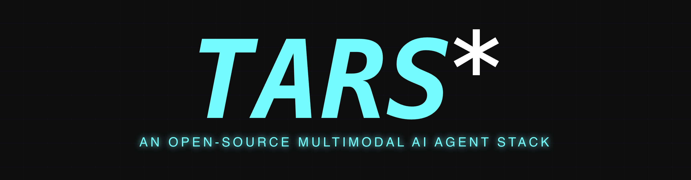

<!-- README.ru-RU.md -->
<picture>
  
</picture>

<br/>

## Intorduction

[](https://trendshift.io/repositories/13584)

[English](./README.md) | [简体中文](./README.zh-CN.md) | [日本語](./README.ja-JP.md) | [한국어](./README.ko-KR.md) |  [Español](./README.es-ES.md) | [العربية](./README.ar-SA.md) | [Français](./README.fr-FR.md) | [Português](./README.pt-BR.md) | Русский

<b>TARS<sup>\*</sup></b> - это мультимодальный ИИ-агентный стек, который объединяет возможности GUI Agent и Vision в твоем терминале, компьютере, браузере и продукте. На данный момент мы запустили два проекта: [Agent TARS](#agent-tars) и [UI-TARS-desktop](#ui-tars-desktop).


## Table of Contents

<!-- START doctoc generated TOC please keep comment here to allow auto update -->
<!-- DON'T EDIT THIS SECTION, INSTEAD RE-RUN doctoc TO UPDATE -->

- [Agent TARS](#agent-tars)
  - [Showcae](#showcae)
  - [Key Features](#key-features)
  - [Quick Start](#quick-start)
  - [Resources](#resources)
- [UI-TARS Desktop](#ui-tars-desktop)
  - [Showcase](#showcase)
  - [Features](#features)
  - [Quick Start](#quick-start-1)
  - [Documentation](#documentation)
- [News](#news)
- [License](#license)
- [Citation](#citation)

<!-- END doctoc generated TOC please keep comment here to allow auto update -->


## Agent TARS

<p>
  <a href="https://discord.gg/HnKcSBgTVx"></a>
  <a href="https://npmjs.com/package/@agent-tars/cli?activeTab=readme"></a>
  <a href="https://npmcharts.com/compare/@agent-tars/cli?minimal=true"></a>
  <a href="https://nodejs.org/en/about/previous-releases"></a>
  <a href="https://twitter.com/agent_tars"></a>
</p>

Agent TARS - это мультимодальный ИИ-агент с открытым исходным кодом, обеспечивающий интеграцию с различными инструментами реального мира. Построенный на мощных возможностях [Seed-1.5-VL](https://github.com/ByteDance-Seed/Seed1.5-VL), он привносит мультимодальное мышление и взаимодействие на основе зрения непосредственно в твой терминал, браузер, компьютер и продукт.

> [!IMPORTANT]  
> Поскольку возможности [UI-TARS-1.5](https://seed-tars.com/1.5) интегрированы в [Seed-1.5-VL](https://github.com/ByteDance-Seed/Seed1.5-VL), ты можешь понимать Agent TARS как наше следующее развитие после UI-TARS. В настоящее время он находится в стадии **Beta**, подробности можно узнать в [последнем твите о релизе](https://x.com/_ulivz/status/1938009759413899384).


### Showcae

```
Tell me the top 10 for Humanity's Last Exam
```

https://github.com/user-attachments/assets/043429c1-2820-47ac-a583-dc12682d1adb

<br>

```
Draw me a chart of Hangzhou's weather for one month
```

https://github.com/user-attachments/assets/a9fd72d0-01bb-4233-aa27-ca95194bbce9

<br>

```
Please book me the earliest flight from Hangzhou to Shenzhen on 10.1
```

https://github.com/user-attachments/assets/fd5d1283-e312-4690-bf1d-85cd2fd4fae4


Больше демонстраций смотри в [#842](https://github.com/bytedance/UI-TARS-desktop/issues/842).

<br>

### Key Features

- 🖱️ **CLI with One-Click Launch** - [Быстрая настройка и запуск](https://agent-tars.com/guide/basic/cli.html) с минимальной конфигурацией
- 🎨 **GUI Agent** - Взаимодействие с GUI на основе зрения с точным контролем
- 🌐 **Browser Integration** - Управление браузерами с использованием [DOM](https://agent-tars.com/guide/basic/browser.html#dom) или [visual grounding](https://agent-tars.com/guide/basic/browser.html#visual-grounding)
- 🔄 **Event Stream Architecture** - Связь в реальном времени между всеми компонентами для динамичных взаимодействий
- 🧰 **MCP Tools** - [Расширение функциональности](https://agent-tars.com/guide/basic/mcp.html) с помощью mcp серверов
- 🌐 **Protocol-Based Web UI** - [Интерактивный интерфейс](https://agent-tars.com/guide/basic/web-ui.html) с потоковыми ответами и поддержкой темной темы
- 🖥️ **Headless Server Support** - [Запуск в фоне](https://agent-tars.com/guide/advanced/server.html) без UI для задач автоматизации
- 📦 **Workspace Management** - [Организация конфигурации и файлов](https://agent-tars.com/guide/basic/workspace.html) с глобальными рабочими пространствами
- 🔍 **Search & Command Tools** - Встроенные инструменты для получения информации и управления системой

<br>

### Quick Start

```bash
# Глобальная установка, требует Node.js >= 22
npm install @agent-tars/cli@latest -g

# Запуск с предпочтительным поставщиком модели
agent-tars --provider volcengine --model doubao-1-5-thinking-vision-pro-250428 --apiKey your-api-key
agent-tars --provider anthropic --model claude-3-7-sonnet-latest --apiKey your-api-key
```

Подробные инструкции по настройке смотри в полном руководстве [Quick Start](https://agent-tars.com/guide/get-started/quick-start.html).


### Documentation

- [Documentation](https://agent-tars.com)
- [Blog](https://agent-tars.com/beta) - Узнай о видении Agent TARS и последних функциях
- [CLI Documentation](https://agent-tars.com/guide/basic/cli.html) - Освой все опции командной строки
- [Join Discord](https://discord.gg/HnKcSBgTVx) - Присоединись к нашему сообществу
- [Follow Official Twitter](https://twitter.com/agent_tars) - Будь в курсе последних новостей
- [Latest release twitter](https://x.com/_ulivz/status/1938009759413899384)

<br/>

## UI-TARS Desktop

<p align="center">
  
</p>

Этот проект - приложение GUI Agent, основанное на [UI-TARS (Vision-Language Model)](https://github.com/bytedance/UI-TARS), которое позволяет управлять компьютером с помощью естественного языка.

<div align="center">
<p>
        &nbsp&nbsp 📑 <a href="https://arxiv.org/abs/2501.12326">Paper</a> &nbsp&nbsp
        | 🤗 <a href="https://huggingface.co/ByteDance-Seed/UI-TARS-1.5-7B">Hugging Face Models</a>&nbsp&nbsp
        | &nbsp&nbsp🫨 <a href="https://discord.gg/pTXwYVjfcs">Discord</a>&nbsp&nbsp
        | &nbsp&nbsp🤖 <a href="https://www.modelscope.cn/collections/UI-TARS-bccb56fa1ef640">ModelScope</a>&nbsp&nbsp
<br>
🖥️ Desktop Application &nbsp&nbsp
| &nbsp&nbsp 👓 <a href="https://github.com/web-infra-dev/midscene">Midscene (use in browser)</a> &nbsp&nbsp
| &nbsp&nbsp <a href="https://deepwiki.com/bytedance/UI-TARS-desktop">
    
  </a>
</p>

</div>

### Showcase

|                                                          Instruction                                                           |                                                Local Operator                                                |                                               Remote Operator                                                |
| :----------------------------------------------------------------------------------------------------------------------------: | :----------------------------------------------------------------------------------------------------------: | :----------------------------------------------------------------------------------------------------------: |
| Please help me open the autosave feature of VS Code and delay AutoSave operations for 500 milliseconds in the VS Code setting. | <video src="https://github.com/user-attachments/assets/e0914ce9-ad33-494b-bdec-0c25c1b01a27" height="300" /> | <video src="https://github.com/user-attachments/assets/01e49b69-7070-46c8-b3e3-2aaaaec71800" height="300" /> |
|                    Could you help me check the latest open issue of the UI-TARS-Desktop project on GitHub?                     | <video src="https://github.com/user-attachments/assets/3d159f54-d24a-4268-96c0-e149607e9199" height="300" /> | <video src="https://github.com/user-attachments/assets/072fb72d-7394-4bfa-95f5-4736e29f7e58" height="300" /> |

### Features

- 🤖 Управление на естественном языке, основанное на модели Vision-Language
- 🖥️ Поддержка скриншотов и визуального распознавания
- 🎯 Точное управление мышью и клавиатурой
- 💻 Мультиплатформенная поддержка (Windows/MacOS/Browser)
- 🔄 Обратная связь в реальном времени и отображение статуса
- 🔐 Безопасность и приватность - полностью локальная обработка
- 🛠️ Простая настройка и интуитивные удаленные операторы

### Quick Start

См.: [Quick Start](./docs/quick-start.md)

### Documentation

- [Deployment](https://github.com/bytedance/UI-TARS/blob/main/README_deploy.md).
- [@ui-tars/sdk](./docs/sdk.md)
- [CONTRIBUTING.md](./CONTRIBUTING.md).

## News

- **\[2025-06-25\]** Мы запустили Agent TARS Beta и Agent TARS CLI - [Представляем Agent TARS Beta](https://agent-tars.com/blog/2025-06-25-introducing-agent-tars-beta.html), мультимодальный ИИ-агент, направленный на исследование формы работы, более близкой к выполнению человеческих задач через богатые мультимодальные возможности (такие как GUI Agent, Vision) и интеграцию с различными инструментами реального мира.
- **\[2025-06-12\]** - 🎁 Мы рады объявить о выпуске UI-TARS Desktop v0.2.0! Это обновление представляет две мощные новые функции: **Remote Computer Operator** и **Remote Browser Operator** — обе полностью бесплатные. Никакой настройки не требуется: просто нажми, чтобы удаленно управлять любым компьютером или браузером, и испытай новый уровень удобства и интеллекта.
- **\[2025-04-17\]** - 🎉 Мы рады объявить о выпуске нового приложения UI-TARS Desktop v0.1.0 с переработанным интерфейсом Agent. Приложение улучшает опыт работы с компьютером, представляет новые функции для работы с браузером и поддерживает [усовершенствованную модель UI-TARS-1.5](https://seed-tars.com/1.5) для повышенной производительности и точного контроля.
- **\[2025-02-20\]** - 📦 Представлен [UI TARS SDK](./docs/sdk.md), мощный мультиплатформенный инструментарий для создания агентов автоматизации GUI.
- **\[2025-01-23\]** - 🚀 Мы обновили раздел **[Cloud Deployment](./docs/deployment.md#cloud-deployment)** в китайской версии: [GUI模型部署教程](https://bytedance.sg.larkoffice.com/docx/TCcudYwyIox5vyxiSDLlgIsTgWf#U94rdCxzBoJMLex38NPlHL21gNb) с новой информацией, связанной с платформой ModelScope. Теперь ты можешь использовать платформу ModelScope для развертывания.

## License

Этот проект лицензирован под Apache License 2.0.

## Citation

Если ты находишь нашу статью и код полезными в своих исследованиях, пожалуйста, рассмотри возможность поставить звезду :star: и процитировать :pencil:

```BibTeX
@article{qin2025ui,
  title={UI-TARS: Pioneering Automated GUI Interaction with Native Agents},
  author={Qin, Yujia and Ye, Yining and Fang, Junjie and Wang, Haoming and Liang, Shihao and Tian, Shizuo and Zhang, Junda and Li, Jiahao and Li, Yunxin and Huang, Shijue and others},
  journal={arXiv preprint arXiv:2501.12326},
  year={2025}
}
```
