# Quick Start

We're excited to announce the support for UI-TARS-1.5! 🎉🎉🎉

The previous version of UI-TARS Desktop version 0.0.8 will be upgraded to a new Desktop App 0.1.0 with support for both Computer and Browser use.

## Download

You can download the [latest release](https://github.com/bytedance/UI-TARS-desktop/releases/latest) version of UI-TARS Desktop from our releases page.

> **Note**: If you have [Homebrew](https://brew.sh/) installed, you can install UI-TARS Desktop by running the following command:
> ```bash
> brew install --cask ui-tars
> ```

## Install

### MacOS

1. Drag **UI TARS** application into the **Applications** folder
  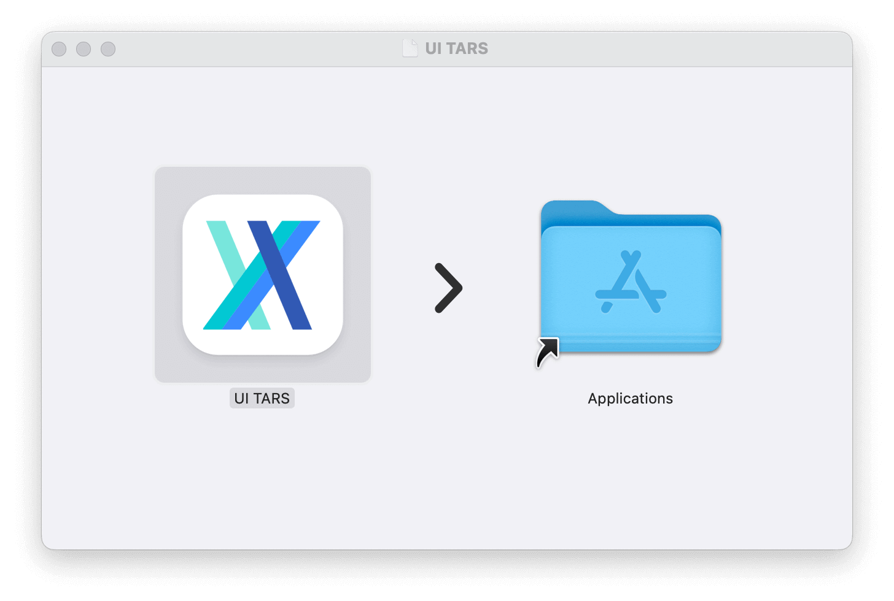

2. Enable the permission of **UI TARS** in MacOS:
  - System Settings -> Privacy & Security -> **Accessibility**
  - System Settings -> Privacy & Security -> **Screen Recording**
  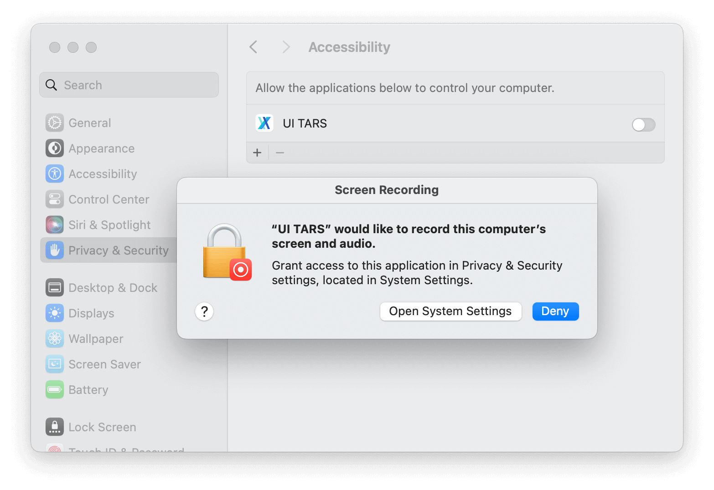

3. Then open **UI TARS** application, you can see the following interface:
  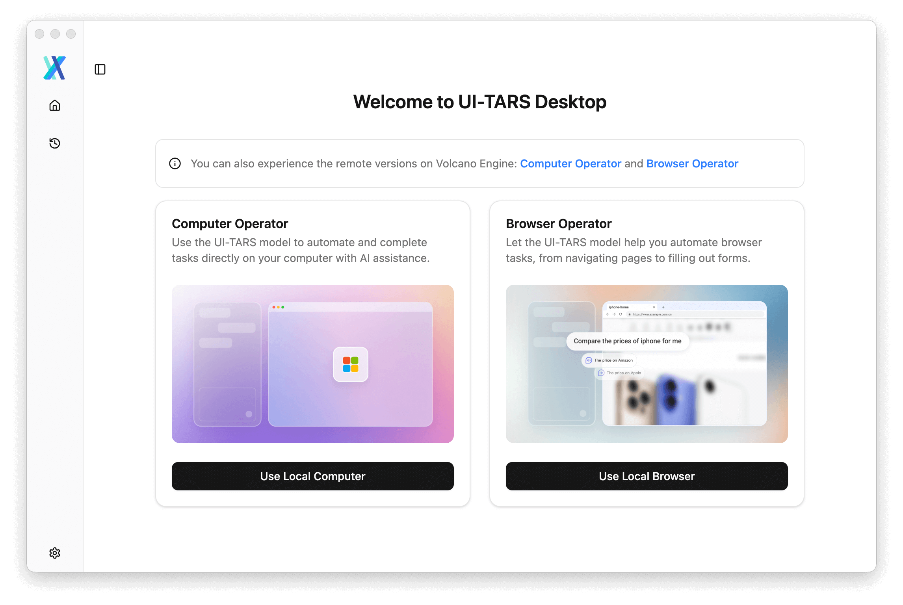


### Windows

**Still to run** the application, you can see the following interface:

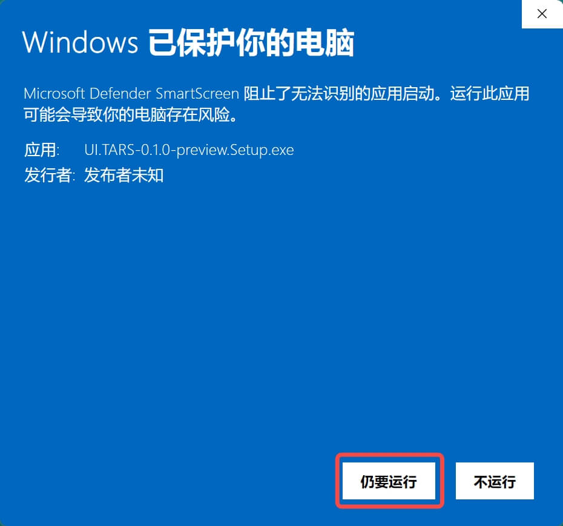

## Get model and run

### UI-TARS-1.5 on [Hugging Face](https://endpoints.huggingface.co/catalog)

1. Click the button `Deploy from Hugging Face` on the top right corner of the page
  

2. Select the model UI-TARS-1.5-7B
  

3. Configure the model settings and select correct VLM Provider after your deployment
  

> Refer to [[UI-TARS-1.5 Deployment Official Guide]](https://github.com/bytedance/UI-TARS/blob/main/README_deploy.md) for more detail about the UI-TARS-1.5's latest deployment methods.

<br />

### Doubao-1.5-UI-TARS on [VolcEngine](https://console.volcengine.com/ark/region:ark+cn-beijing/model/detail?Id=doubao-1-5-ui-tars)


1.Visit the [VolcEngine Doubao-1.5-UI-TARS page](https://console.volcengine.com/ark/region:ark+cn-beijing/model/detail?Id=doubao-1-5-ui-tars)


2. Click the button `Try (立即体验)` on the top right corner of the page
  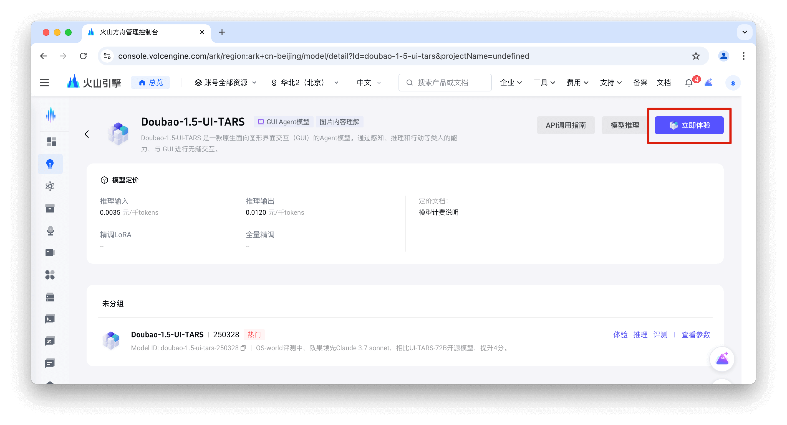

3. Click the `API inference (API 接入)` link
  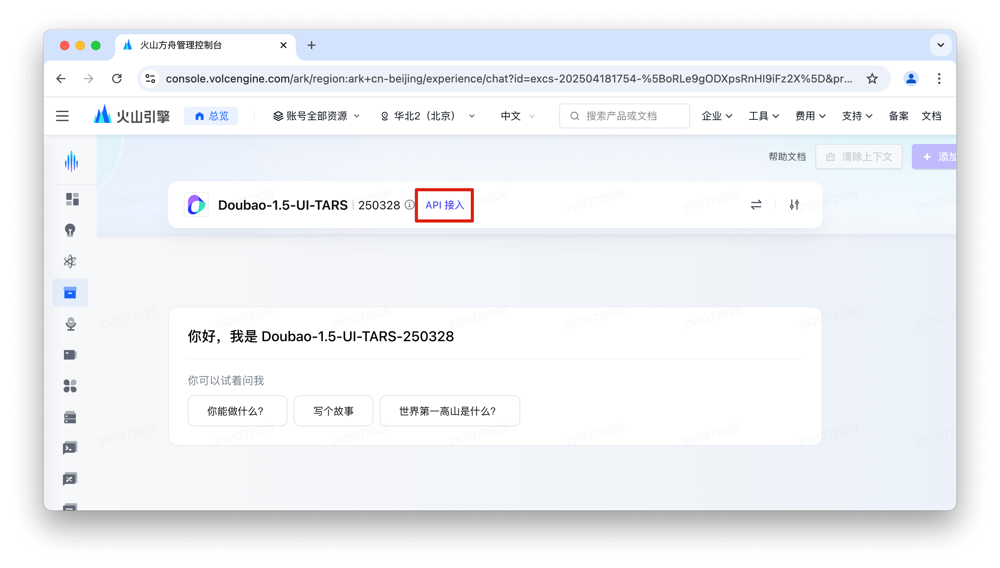

  Complete identity verification to obtain the model configuration.

4. Get your **API KEY** from STEP 1 in the drawer panel.
  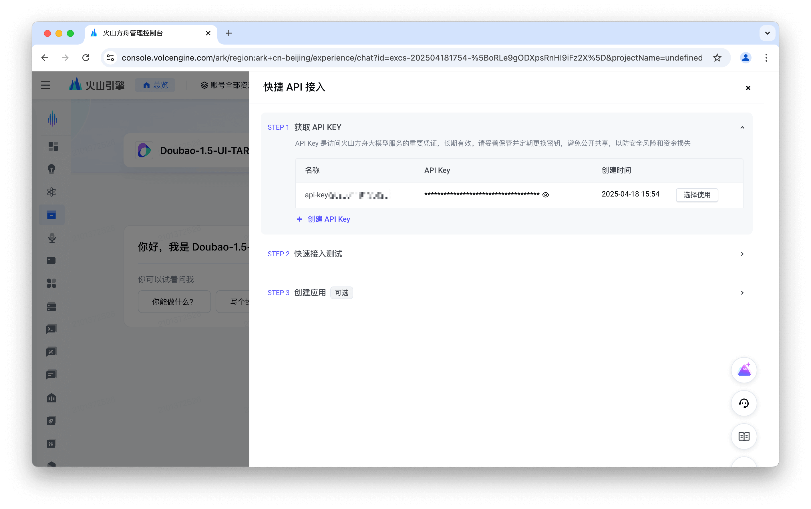

5. In STEP 2, authenticate your user info and switch to the OPENAI SDK tab to obtain **Base Url** and **Model name**：
  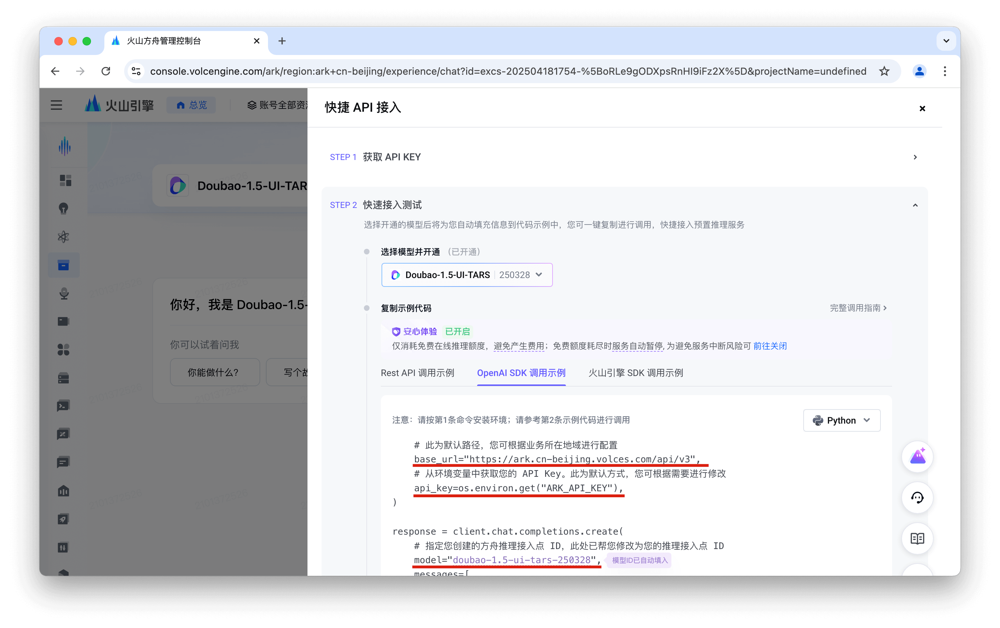

6. Open the UI-TARS Desktop App [Settings]((./setting.md)) and configure:

```yaml
Language: cn
VLM Provider: VolcEngine Ark for Doubao-1.5-UI-TARS
VLM Base URL: ttps://ark.cn-beijing.volces.com/api/v3
VLM API KEY: ARK_API_KEY
VLM Model Name: doubao-1.5-ui-tars-250328
```

> [!NOTE]
> For VLM Provider, make sure to select "VolcEngine Ark for Doubao-1.5-UI-TARS" to ensure proper VLM Action parsing.

  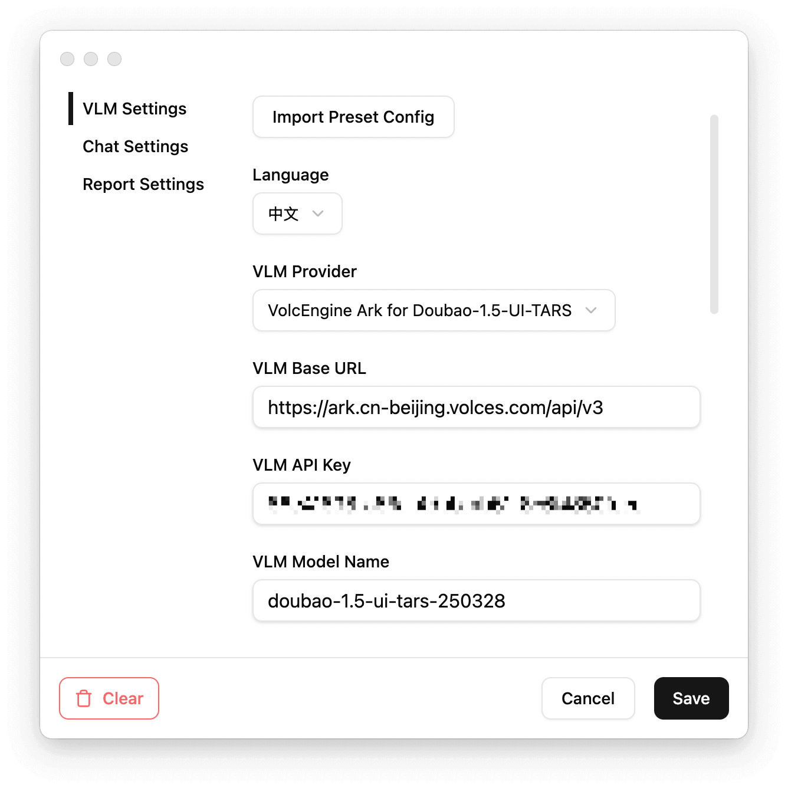


7. Select the desired usage scenario before starting a new chat
  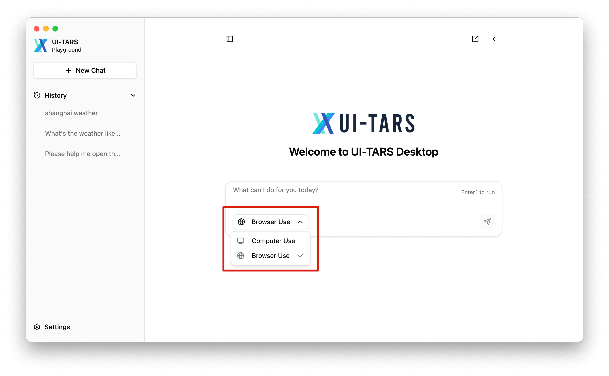

8. Input the command to start a round of GUI operation tasks!

  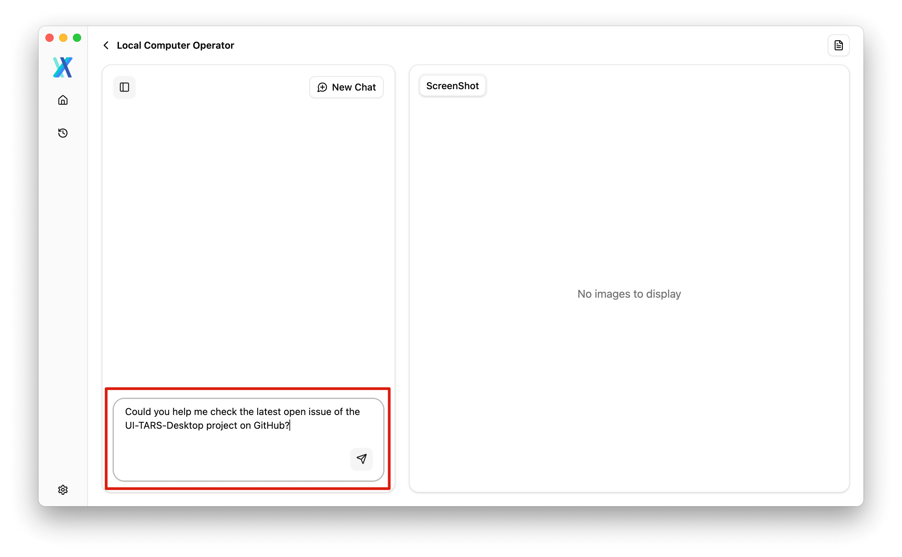


<br>

<br>


## More

> Refer to [UI-TARS Model Deployment Guide (Chinese)](https://bytedance.sg.larkoffice.com/docx/TCcudYwyIox5vyxiSDLlgIsTgWf) for more detail about the Doubao-1.5-UI-TARS's latest deployment methods.

## Add your model settings

1. Click the **Settings** button on the bottom left corner of the application
  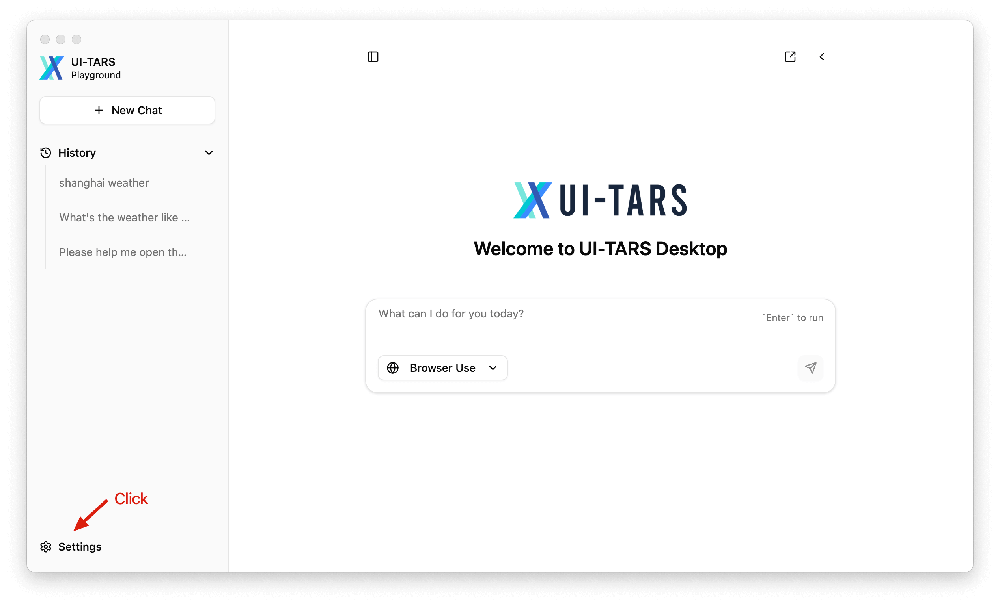

> Read the [Settings Configuration Guide](./setting.md) and set up VLM/Chat parameters. Selecting the appropriate VLM Provider can optimize desktop app performance when using model.

2. Select the desired usage scenario before starting a new chat
  

3. Input the command to start a round of GUI operation tasks!

  