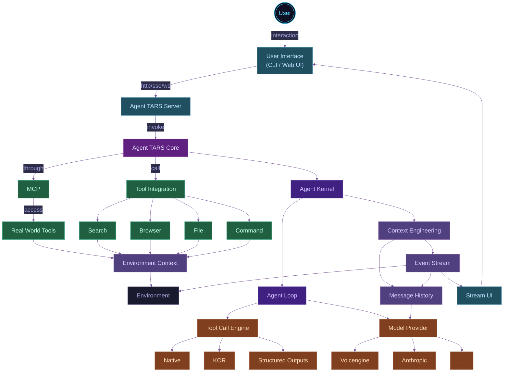

import { Badge } from '@theme';
import { IntroAnimation, ShowcasePanels, VideoPanel, Figure } from '../../../src/components';

import { CgTerminal } from 'react-icons/cg';

# Introducing Agent TARS Beta

<br />

<p align="right">
  <Badge type="info">
    <CgTerminal />
    <span>Agent TARS CLI</span>
  </Badge>
</p>

<br />

<IntroAnimation />

<br />
<br />

<br />

{/*  */}

## Lock Back

In March, we open-sourced an early [technical preview](https://agent-tars.com/2025/03/18/announcing-agent-tars-app) version of Agent TARS. The slogan of Agent TARS is <u>“An open-source multimodal AI agent, offering seamless integration with a wide range of real-world tools”.</u> After our release, it received some support from the community and accumulated a certain amount of influence.

<br />

<ShowcasePanels
  defaultHeight="140px"
  panels={[
    {
      content: ,
      title: 'agent-tars.com',
      link: 'https://agent-tars.com',
    },
    {
      content: ,
      title: 'agent-tars.com/showcase',
      link: 'https://agent-tars.com/showcase',
    },
    {
      content: <VideoPanel src="/alpha/showcase.mp4" controls={false} autoPlay />,
      title: 'first demo',
    },
  ]}
/>

<br />

<ShowcasePanels
  defaultHeight="80px"
  panels={[
    {
      content: ,
      title: 'community Support ',
    },
    {
      content: ,
      title: 'trouble shooting',
    },
    {
      content: <VideoPanel src="/alpha/config-mcp-servers.mp4" controls={false} autoPlay />,
      title: 'MCP support',
    },
    {
      content: <VideoPanel src="/alpha/local-browser-search.mp4" controls={false} autoPlay />,
      title: 'Local browser search',
    },
    {
      content: <VideoPanel src="/alpha/reach-10000.mp4" controls={false} autoPlay />,
      title: '1000 stars',
    },
  ]}
/>

> _\* 这些过去的时刻，你都可以在我们的[官方推特](https://x.com/AgentTars)中找到。_

在一段时间的迭代后，一方面，Seed 多模态模型逐步增强，如 **[UI-TARS 1.5](https://seed-tars.com/1.5/)** 和 **[Doubao 1.5 VL](https://seed.bytedance.com/zh/tech/seed1_5_vl)** 的相继发布，另一方面，在开源社区上我们收到了了较多的反馈，此外，我们也面临现有架构难以支撑项目长期发展的挑战，如 Agent UI 没有解耦，难以支撑评测和独立使用。

在经过一段时间的架构设计和迭代后，我们带来了 **Agent TARS** 的 **Beta** 版本，我们将首先为你推出 **Agent TARS** **CLI**，一款旨在让你 "**随时随地可用**" 的 **Multimodal** **AI Agent** 工具。

## Cognition

在进入正式新版本介绍之前，我们会为你简单阐述一些我们对 Agent TARS 的设计原则的认知，将有助于你理解这次发布。在 Agent TARS 核心团队的目标里，一个健壮的 Agent 体系，需要做好三个要素：

1. [Context Engineering](#context-engineering)
2. [Observable and Evaluable](#observable-and-evaluable)
3. [Easy to build applications](#easy-to-build-applications)

<br/>

### Context Engineering

Building Long-running Agents 是 Agent TARS 的长期目标之一，以下述例子为例：

<VideoPanel src="https://lf3-static.bytednsdoc.com/obj/eden-cn/zyha-aulnh/ljhwZthlaukjlkulzlp/docs/agent-tars-search-flight-info.mp4" controls autoPlay loop />

上述演示中，Agent 经过二十轮左右完成了任务，尤其是在多模态任务下，如果没有细致的 Context Engineering，上下文非常容易溢出。在 Agent TARS 中，Context Engineering 体现在以下几个方面：

---

#### Take care of Context Window

在 Agent TARS 中，每一轮 Agent Loop 的 Memory 的主要组成部分如下：

<Figure 
  src="/agent-loop-memory.png" 
  title="Figure 1: Agent Loop Memory" 
  zoom={1.4} 
  maxWidth="70%" 
/>

这些内容会在每一个 Agent Loop 中，被 “动态” 构造为一个请求，并受到模型的 Context Window 的影响。目前，典型的模型上下文窗口如下：

{/* https://platform.openai.com/docs/models */} {/* https://docs.anthropic.com/en/docs/about-claude/models/overview */}

<Figure 
  src="/llm-context-window.png" 
  title="Figure 2: Context Window of Typical Models (As of 2025.5)" 
  zoom={1.3} 
  maxWidth="50%" 
/>

我们以 128k 上下文为例，假设以 Research 类任务为代表的每轮工具调用的 Tool Result 平均为 `5000` tokens，若 System Prompt 忽略不计，我们可以推导出在没有任何处理的情况下，Agent 会在第 `26` 轮溢出，这显然无法做到长期运行。

与此同时，如果考虑到多模态 GUI Agent，尽管不同模型的 Serving 在 image 上的计算有一些差异，我们建设 `detail:high` 下一张图高达 5000 tokens<sup>[2]</sup>。为了解决这一问题，Agent TARS 内部采用了 “针对不同模态内容采用不同的滑动窗口” 的动态策略，并面向 Context Window 进行优化和计算。

{/* https://www.reddit.com/r/OpenAI/comments/1k6od52/a_comparison_of_lowmediumhigh_with_new_images_api/ */}


---

#### MCP may bring instability

从 Agent TARS 早期阶段开始，我们一直在建设 MCP，你可以在 [MCP Brings a New Paradigm to Layered AI Application Development](https://agent-tars.com/2025/03/25/mcp-brings-a-new-paradigm-to-layered-ai-app-development) 找到我们早期的实践。

在 Agent TARS Beta 中，我们内部仍然采用了类似的架构，但略有不同。这源于我们面临的新挑战，我们发现，MCP 虽然有效地解决了 “Agent 开发者与工具开发者分离” 的问题，但在 Context Engineering 这件事上，MCP 似乎带来了一些混沌：


<Figure 
  src="/agent-call-mcp.png" 
  title="Figure 3: How does MCP provide context to Agent" 
  zoom={1.4}
  maxWidth="75%"
/>

从上述的图中可以看出，如果我们采用标准的 “分离” 做法，即 Agent 充分信任通过 MCP Client 获取到的来自 MCP Servers 的 Tool Definitions 和 Tool Result，那么，你可能会面临如下问题：

1. **Tool 参数的潜在问题**：尤其是在部分对 Parameters 进行了 Schema Stric Check 的模型中，你可能无法运行；
2. **Tool Result 过大的问题**：一个 “出品不佳” 的 MCP，一轮调用即可导致 Context Overflow，如下：

::: danger 令人抓狂的 Context Overflow 错误

> 400 This model's maximum context length is 128000 tokens. However, your messages resulted in 138773 tokens. Please reduce the length of the messages.

:::

没错，第二个问题是这里讨论的核心问题，尤其是在 MCP Browser 的实践中，我们发现以 `browser_get_html`、`browser_get_text` 为代表的工具，会导致 Agent 在大量网站上无法运行。为此，我们不得不去废弃这些工具，或换取更好的实现，如 `browser_get_markdown`。

::: tip 关于 MCP 的洞见

基于上述引述，我们大抵可以得出以下推论：如果一个 Agent 越需要细粒度的 Context Engineering 控制，那么他可能就越不需要 MCP 的静默 Prompt 注入行为。即便接入了 MCP，Agent 开发者仍然需要像操作 Function Tool 一样进行很多细粒度的控制。从这个角度看，MCP 对于生产级 Agent 的价值应该是标准化的 Tool 分发协议，而非通过 `mcpServers` 等方式自由拓展 Tool。

关于 MCP 的实践和观点我们还有很多，请期待我们后续的更新。

:::

目前，社区存在各种各样的 MCP Registry，其质量参差不齐，从长期发展来看，MCP 的生态应当有一套标准的 Benchmark，为每个工具的各项表现（如模型兼容性、上下文压缩率、性能等等）得出明确的评分参考，以便 Agent 开发者更好的选择。

---

#### Context Compress

做到上面这些就够了吗？显然不够，在 Agent TARS 接下来的计划中，我们正在推动完成一种多级 Memory 设计：

| Level           | Deifntion                                                         |
| --------------- | ----------------------------------------------------------------- |
| L0（Permanet） | 永久记忆，跨所有 Session Run 保留，如用户初始输入消息、模型的 Final Answer |
| L1（Run）      | 仅在当前 Session Run 中生效的记忆，如当前 Run 的 Plan                   |
| L2（Loop）      | 仅在当前 Run Loop 中生效的记忆，如 Tool Call、Tool Result、 环境输入等   |
| L3（Ephemeral） | 临时记忆，如流式的消息 Chunk、 Agent 的 One-time status                 |


<Figure 
  src="/hierarchical-context.png" 
  title="Figure 4: Hierarchical Context" 
  zoom={1.3}
  maxWidth="80%"
/>


接着，结合上述的分级策略，我们会进一步采用一些策略来针对不同 Level 的 Context 进行压缩：

- [Selective Context](https://arxiv.org/abs/2304.12102)：使用智能压缩算法减少消息内容
- Summary：使用 LLM / SLM 生成对话摘要

::: tip Responses API
除此之外，我们正在计划在 [Chat Completion](https://platform.openai.com/docs/api-reference/chat) 的基础上，让 Agent 的 LLM API Protocol 继续支持 [Responses API](https://platform.openai.com/docs/api-reference/responses)，利用 LLM Serving 的 Image Cache 进一步提升多模态推理任务场景下的性能。
:::

---


### Observable and Evaluable

<b>“可观测，与可评估”，是所有 Agent Framework 都会面临和需要的问题”</b>。这里，我们主要阐述一下 Agent TARS 中建设的差异，以及我们的一些演进方向。

#### Snapshot

在 Agent TARS 中，由于主要的场景是 Long-steps task，在此类场景下面临的主要挑战是 Agent 的内部细节越来越难以观测，框架持续迭代的稳定性面临巨大挑战，为此，我们需要引入一种观测 Agent 运行的机制。在 Agent TARS Kernel 中，Agent 在运行期间来自环境的因素非常多，如：

1. LLM：即便是针对相同的输入，LLM Response 充满着巨大的随机性；
2. 环境初始化：如 Local 或 Remote 虚拟容器（包含 Browser）的启动；
3. 工具：不可控的 Tool Call 与 MCP 调用，尤其是存在 Connect 过程的 MCP；

<Figure 
  src="/changing-environment.png" 
  title="Figure 4: Complex and changing environment" 
  zoom={1.3}
  maxWidth="80%"
/>

为此，我们需要引入一种设计模式，能够够在运行时将 Agent 所依赖的环境保存为 Snapshot，接着，可以基于 Snapshot 来回放 Agent，确保 Agent 的 Context、Run Loop state，与最终的 Response 符合预期。最终设计的框架代码如下：

```ts
import { Agent } from '@multimodal/agent';
import { AgentSnapshot } from '@multimodal/agent-snapshot';

const agent = new Agent({/* Agent Options */})
const agentSnapshot = new AgentSnapshot(agent, {
  snapshotPath: './fixtures/',
});

// generate
await agentSnapshot.generate(runOptions);
// replay
await agentSnapshot.replay(runOptions);
```

这一框架已经驱动了 Agent TARS 的持续集成s，并已驱动 `@multimodal/agent`、`@mcp-agent/core`、`@magent-tars/core` 的测试，目前帮助我们在 Beta 的开发中至少规避了 5+ Bugs：

<br/  >

<ShowcasePanels
  panels={[
    {
      content: <VideoPanel src="https://lf3-static.bytednsdoc.com/obj/eden-cn/zyha-aulnh/ljhwZthlaukjlkulzlp/docs/videos/agent-snapshot-vitest.mp4" controls={false} autoPlay />,
      title: 'Snapshot-based environment playback agent',
    },
    {
      content: <VideoPanel src="https://lf3-static.bytednsdoc.com/obj/eden-cn/zyha-aulnh/ljhwZthlaukjlkulzlp/docs/videos/agent-snapshot-replay-failed.mp4" controls={false} autoPlay />,
      title: 'Discover framework iteration bugs',
    },
  ]}
/>


<br />


#### Benchmark

在 Alpha 中，Agent TARS 是一个 Electron 应用，导致我们只能人工评测，效率底下；从 Beta 开始，Agent TARS 带来了 Agent 与 UI 分层的新架构，让我们进行自动化评测成为可能。我们参考了 OpenAI 的 [simple-evals](https://github.com/openai/simple-evals)，通过 Python 与 TypeScript 的跨进程调用，实现了能够用于 Agent TARS 的 [browsecomp](https://github.com/agent-infra/browsecomp) 评测方案：

```bash
python browsecomp.py --command "/path/to/agent-tars" --examples 1
```

除此之外，我们同时在建设一些针对 MCP Tools 的基础评测集，目前已经部分在评测 Agent TARS 内部的 MCP Agent 的跨模型兼容表现，在这些能力全部完善后，我们会在正式的版本中推出完整的评测方案和官方评测结果。

---


### Easy to build applications

#### Event-stream

为了让你更快地理解 Event Stream 是什么，以及解决了什么问题，我们通过一个实际的例子来向你演示。

当你在本地启动 Agent TARS CLI，你将能够通过 `curl` 来完成一次调用，

```bash
curl --location 'http://localhost:8888/api/sessions/query/stream' \
--header 'Content-Type: application/json' \
--data '{
	"sessionId": "7oydcIJGJQcvaGdjbAQHz",
	"query": "Search the GUI Agent paper"
}'
```


#### Agent-UI protocol


## Archtecutre 

基于上述认知，我们将 Agent TARS Beta 进行了完全的重写，带来了全新的多层分层架构，其核心构建在一个基于 Event Stream 驱动的 Agent Kernel 上，其主要组成部分如下：

<br/>



<br />

<p align="center" className='text-sm'>
<span>Figure 1: Architecture of Agent TARS Beta.</span>
</p>

<br />
<br />

从技术架构上来说，Agent TARS Beta 让 Agent TARS 从一个 Electron App 演进到一个 Agent 生态系统。


## What's New?

### 混合驱动的 Browser Agent

### Native Streaming

### New Web UI

### Agent SDK

## Quick Start

## What's Next?

## References

\[1] [Don’t Build Multi-Agents](https://cognition.ai/blog/dont-build-multi-agents)
\[2] [Volcengine > Vision](https://www.volcengine.com/docs/82379/1362931)


（没错，在 Agent Loop 中，LLM 本质也是环境）；


为此，我们引入了一种设计模式，能够够在运行时将 Agent 所依赖的环境保存为 Snapshot，接着，可以基于 Snapshot 来回放 Agent，确保 Agent 最终的内存输出、状态符合预期。
